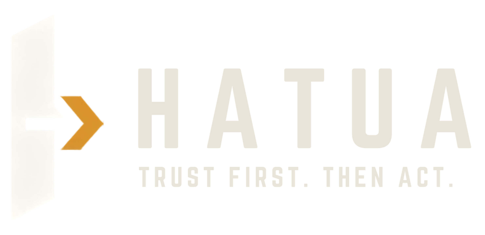

<div align="center">
  <table border="0" cellpadding="28">
    <tr>
      <td align="center" bgcolor="#121212">
        
      </td>
    </tr>
  </table>
</div>

# Hatua

**Trusted action from Conduit@Empathy.**

Hatua (Kiswahili for *step* / *action*) is the last mile from JKUAT’s Conduit climate station to a decision someone takes the same day: whether a reading is trustworthy, and whether to go outside, hydrate, ventilate, or wait on water.

This repository is our entry for [Hack The Weather 2026](https://hack-the-weather.devpost.com/) (JHUB Africa / JKUAT) — theme **From Data to Impact**.

> Conduit already measures the Juja microclimate every minute. People next to the sculpture still decide from the sky, and AquaTwin would calibrate satellites against silent sensor faults. We do not ship another weather dashboard.

| | |
| --- | --- |
| Hackathon | [Hack The Weather 2026](https://hack-the-weather.devpost.com/) · 6–9 Sep 2026 |
| Mandatory data | [Conduit@Empathy](https://conduit.jhubafrica.com/) · CHORDS instrument **61** (Site JKUAT) |
| Licence | [MIT](LICENSE) |
| Status | Working prototype: trust-gated actions, replay of the organiser extract, shadcn/ui console |

---

## Problem

Outdoor workers, students, and nearby farmers around JKUAT have a world-class climate station on campus and still decide from the sky. Conduit@Empathy records heat, humidity, rain, wind, and radiation every minute, but those observations are not checked for sensor failure and are not turned into a go / delay / protect decision.

In the sample week organisers shared (28 Aug–1 Sep 2026):

- Rain was **0.4 mm** total (two 0.2 mm tips). Four days had **0 mm**.
- Rain gauge 2 never moved. Wind gust direction is a copy of gust speed. Battery voltage is empty. A health flag of `33501705` appears once a night.
- Afternoons still reached heat index ~27.5 °C and WBGT ~22 °C with UV up. Nights sat at 85–90%+ relative humidity for hours.

The problem is not missing charts. It is the missing step from **trusted Conduit observations** to an **action the same day**.

Full write-up: [`docs/problem.md`](docs/problem.md). Architecture: [`docs/architecture.md`](docs/architecture.md). Challenge notes: [`docs/info.md`](docs/info.md).

---

## Solution

Hatua is a **trust-gated action layer** on Conduit — not a twin of AquaTwin and not a national flood model.

1. **Trust gate** — every timestep from instrument 61 is checked before it may drive an alert (stuck gauge, cloned fields, garbage health, thermometer disagreement).
2. **Insight** — heat / UV exposure, overnight humidity (leaf-wetness / storage risk), rain onset from gauge 1 only, and a water-demand proxy from T, RH, wind, and radiation. No fake soil moisture.
3. **Ground vs model** — Conduit gauge 1 is used to residual-check a public forecast for Juja, so a model cannot silently overstate rain.
4. **Action** — a recommendation card: go / shade / hydrate; ventilate overnight; do not irrigate; do not ingest this timestep into AquaTwin.

If you unplug Conduit, Hatua has nothing to say. That is intentional.

### Who it is for

| Face | User | Decision |
| --- | --- | --- |
| Campus | Grounds crews, construction, sports, clinics | Go / shade / hydrate / delay |
| Farm | Juja–Thika horticulture | Irrigate or wait; ventilate overnight |
| Science | AquaTwin / SPACE-SI / JHUB | Use / degrade / discard this timestep |

---

## Conduit data

We **must** use Conduit@Empathy. The live station is a 3D-PAWS AWS on the FEWSNET CHORDS portal.

| Field | Value |
| --- | --- |
| Platform | [https://conduit.jhubafrica.com/](https://conduit.jhubafrica.com/) |
| Twin dashboard | [https://conduit.jhubafrica.com/model.html](https://conduit.jhubafrica.com/model.html) |
| CHORDS instrument | [id 61](https://3d-fewsnet.icdp.ucar.edu/instruments/61) · Site JKUAT (id 62) |
| Location | 37.014528 E, 1.099736 S, 1523 m (Juja, Kiambu) |
| Shared extract | [`data/3DFEWSNET_SiteJKUAT_KenyaKiambuJKUATIOTAWS-Conduti@Empathy1.csv`](data/3DFEWSNET_SiteJKUAT_KenyaKiambuJKUATIOTAWS-Conduti@Empathy1.csv) |
| Extract window | 2026-08-28 00:00 UTC → 2026-09-01 23:58 UTC · ~1 min cadence · 7,060 rows |

**Used in the product:** rain gauge 1, BMX / MCP / SHT temperature, SHT humidity, pressure, SI1145 visible / IR / UV, wind speed and direction, gust, heat index, wet bulb, WBGT.

**Treated as faults, not climate:** rain gauge 2 (all zeros in the extract), wind gust direction (duplicate of gust), battery voltage (missing), health spikes.

Soil moisture, vegetation, and water quality are advertised for Conduit but are **not in this extract**. We do not invent them.

Live pulls use the CHORDS HTTP API (`/api/v1/data/61.geojson?last`). Do not commit API keys; see [SECURITY.md](SECURITY.md). The browser never calls CHORDS.

---

## What ships

- **NOW** — role-aware action cards (Campus / Farm / Science) with a trust chip
- **Trust** — verdict timeline and gauge-2 autopsy
- **Residuals** — daily gauge-1 mm vs Open-Meteo
- **Replay** — scrub the organiser file; `2026-08-31T03:41:33Z` shows `RAIN_ONSET`
- **Station 61** — dossier, policy versions, CHORDS attribution
- Versioned YAML: `packages/core/hatua_core/policy/trust_v1.yaml`, `actions_v1.yaml`

---

## Architecture

```
Conduit CHORDS (instrument 61) + shared CSV
        │
        ▼
   apps/worker  ingest → trust_v1 → actions_v1 → residuals
        │
        ▼
   Postgres / SQLite
        │
        ▼
   apps/api  FastAPI reads + POST /v1/replay + SSE
        │
        ▼
   apps/web  Next.js + shadcn/ui (never talks to CHORDS)
```

Domain lives in `packages/core`. Details: [`docs/architecture.md`](docs/architecture.md).

---

## Technology stack

- Python 3.11 · FastAPI · SQLAlchemy · PyYAML · httpx
- Next.js 16 · React 19 · Tailwind 4 · [shadcn/ui](https://ui.shadcn.com/) · TanStack Query · Recharts (via shadcn Chart)
- SQLite locally · Postgres in Docker Compose
- Open-Meteo for the residual check (optional; UI still works if the model is down)

AI coding assistants were used to draft and implement this prototype. No ML model ships in the product. The team remains responsible for architecture, data handling, and the demo.

---

## Repository layout

```
apps/web          Next.js App Router + shadcn/ui
apps/api          FastAPI read API
apps/worker       CSV backfill, live poll, forecast fuse
packages/core     hatua_core domain, policy YAML, adapters
infra/            docker-compose, Dockerfiles, SQL migrate
data/             organiser GeoCSV (read-only input)
docs/             challenge brief, problem, architecture
tests/            trust, actions, ingest, replay, API
```

---

## Installation and setup

Python **3.11+** and Node **20+**. From the repo root:

```bash
# Python
uv venv --python python3.11 .venv
source .venv/bin/activate
uv pip install -e ".[dev]"

# Web
cd apps/web
pnpm install
cp .env.example .env.local
# NEXT_PUBLIC_API_URL=http://localhost:8000
```

Copy [`.env.example`](.env.example) for the API/worker. Never commit `.env` or CHORDS keys.

---

## Usage

Local demo on SQLite (the path judges can run without Docker):

```bash
# 1. Backfill the organiser CSV once
HATUA_ONCE=1 .venv/bin/python apps/worker/main.py

# 2. API
.venv/bin/uvicorn main:app --app-dir apps/api --host 127.0.0.1 --port 8000

# 3. Web (another terminal)
cd apps/web && pnpm dev
```

Open [http://localhost:3000](http://localhost:3000) for Home. Now is [http://localhost:3000/now](http://localhost:3000/now). Role switch: Campus | Farm | Science.

Replay the rain tip:

```bash
curl -s -X POST http://127.0.0.1:8000/v1/replay \
  -H 'content-type: application/json' \
  -d '{"t":"2026-08-31T03:41:33Z","station_id":61}'
```

Then open `/replay` or `/` — NOW should show **Rain has started at gauge 1**.

Docker Compose (Postgres + api + worker + web):

```bash
docker compose -f infra/docker-compose.yml up --build
```

Live CHORDS polling (optional): set `HATUA_LIVE=1`, `CHORDS_EMAIL`, and `CHORDS_API_KEY`. Omit them and the worker stays on the CSV.

### Tests

```bash
.venv/bin/pytest
```

Covers trust fixtures from the real extract, action hysteresis, idempotent ingest, and replay of `2026-08-31T03:41:33Z` → `RAIN_ONSET`.

---

## Data sources

| Source | Role | Attribution |
| --- | --- | --- |
| Conduit@Empathy / JHUB Africa / JKUAT | Mandatory ground observations | [conduit.jhubafrica.com](https://conduit.jhubafrica.com/) |
| 3D-PAWS FEWSNET CHORDS (NCAR/RAL) | Archive and live API for instrument 61 | [DOI 10.5065/D6V1236Q](https://doi.org/10.5065/D6V1236Q) |
| Open-Meteo | Residual check against gauge 1 | [open-meteo.com](https://open-meteo.com/) |

---

## AI usage

No shipped model. Docs and implementation were drafted with AI assistance. Disclose significant AI use on Devpost as required by the official rules.

---

## Team

| Name | Role |
| --- | --- |
| Eugene Mutembei | Repository owner |

Add teammates here when the 2–5 person hackathon team is locked (one Team Lead, every member registered on Devpost).

---

## Future development

- Campus estates as the first operator of heat / UV actions
- Kiambu horticulture using the longer CHORDS archive (May 2025–present)
- Trusted-timestep feed for AquaTwin / SPACE-SI calibration
- Other Kenya 3D-PAWS stations on the same trust + action engine

---

## Contributing

See [CONTRIBUTING.md](CONTRIBUTING.md).

## Security

See [SECURITY.md](SECURITY.md). Never commit passwords, API keys, or tokens.

## Licence

[MIT](LICENSE) © 2026 Eugene Mutembei. Conduit and CHORDS data remain subject to their own terms. Hatua does not claim ownership of JKUAT, JHUB Africa, SPACE-SI, or NCAR data.
